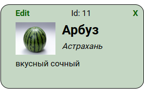

# Empty vite template

Админка карточек (товаров):

Слева присутствует форма для создания и добавления и редактирования карточек:

Справа есть витрина, которая показывает все созданные карточки:

Есть кнопка, которая позвоялет задать начальные карточки на сайте:

На каждой карточке есть надпись "Edit", которая переносит данные на форму и позволяет их редактировать и сохранять. И крестик, который позволяет удалить ту или иную карточку.

Правила запуска:
Предварительно должны быть установлены git и nodejs(версия lts 16 и выше)
- install node.js v16>(npm v7.x>) (https://nodejs.org/en/download/)
- install git(https://git-scm.com/downloads)

Далее:

- `npm i` - установка зависимостей таких как less, scss и прочее(появляется папка node-modules и файл package-lock.json)
- После установки пакетов `npm run dev` - запускается dev-server, в терминале будет указан адресс и порт на котором запустился сервер
- Открываем адресс в браузере(например он будет таким `http://127.0.0.1:5173`), и видим как наш проект(сайт) отображается в браузере
- Начинаем разработку приложения: изменяем html, создаем less(scss/sass или css) файлы, добавляем в них стили и приминяем их в html. Вкладка в браузере с адресом dev сервера(которая запустилась командой `npm run dev`) будет автоматически перерендериваться по мере добавления кода
